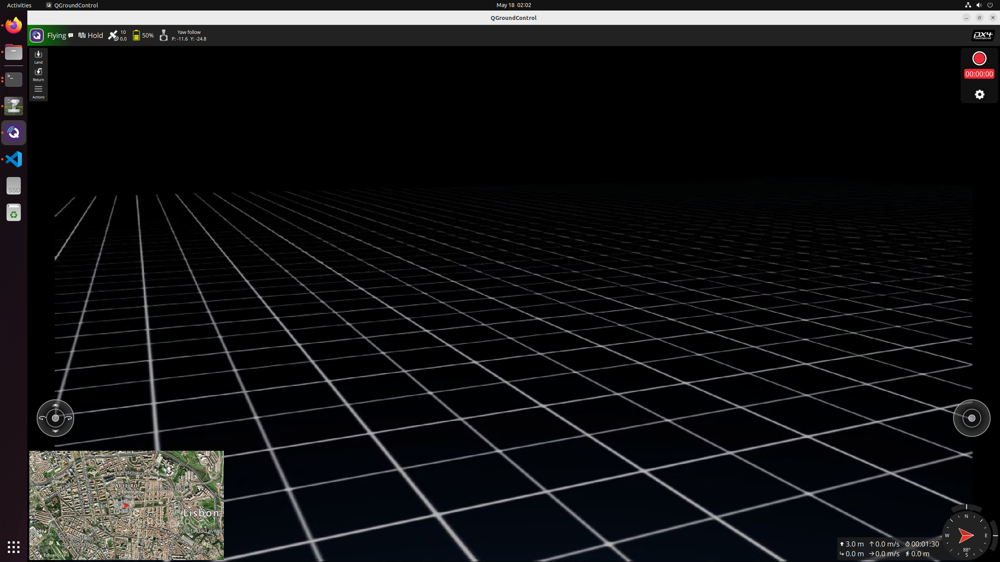
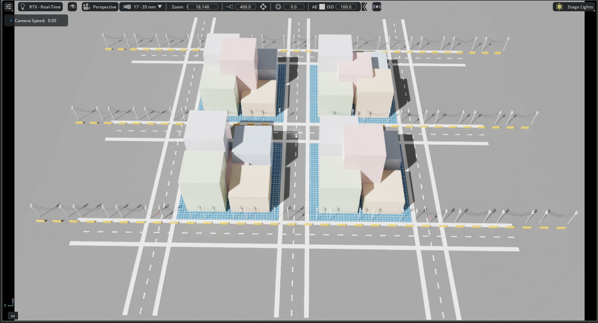

# UAV Simulation Take-Home

This repository documents a reproducible UAV simulation workflow using NVIDIA
Isaac Sim, Pegasus Simulator, PX4 SITL, MAVProxy, and QGroundControl.

The required challenge scope is implemented first: installation notes, PX4 and
Pegasus integration, explicit MAVProxy routing, QGroundControl telemetry through
MAVProxy, and basic verification scripts. Optional extensions for MAVSDK,
gimbal control, QGroundControl video, QGroundControl camera/gimbal UI discovery,
and a collidable outdoor/urban Isaac Sim environment are all implemented.

## Documentation

Start here:

| Document | Purpose |
| --- | --- |
| [INSTALLATION.md](INSTALLATION.md) | Detailed installation log, host specs, versions, problems encountered, workarounds, validation results, and known limitations. |
| [RUNBOOK.md](RUNBOOK.md) | Repeatable startup order and day-to-day run instructions for Isaac Sim, Pegasus, PX4, MAVProxy, QGroundControl, and verification scripts. |

## Current Status

Required challenge items:

| Requirement | Status | Evidence |
| --- | --- | --- |
| Installation notes | Complete | [INSTALLATION.md](INSTALLATION.md) |
| Basic PX4 + Pegasus simulation | Complete | PX4/Pegasus heartbeat and telemetry documented in [INSTALLATION.md](INSTALLATION.md) |
| MAVProxy routing | Complete | [configs/run_mavproxy.sh](configs/run_mavproxy.sh) |
| QGroundControl through explicit MAVProxy endpoint | Complete | [evidence/qgroundcontrol-mavproxy-telemetry.png](evidence/qgroundcontrol-mavproxy-telemetry.png) |
| Basic automation / verification | Complete | [scripts/verify_mavlink_route.sh](scripts/verify_mavlink_route.sh), [scripts/verify_mavlink_live.py](scripts/verify_mavlink_live.py), [scripts/report_preflight_status.py](scripts/report_preflight_status.py) |
| Run instructions | Complete | [RUNBOOK.md](RUNBOOK.md) |

Optional items:

| Optional Item | Status | Notes |
| --- | --- | --- |
| Outdoor / urban Isaac Sim environment | Complete | [scripts/add_urban_environment.py](scripts/add_urban_environment.py) — collidable static urban obstacles via `UsdPhysics.CollisionAPI` |
| Gimbal camera | Complete | [scripts/add_gimbal_camera.py](scripts/add_gimbal_camera.py) |
| QGroundControl video stream | Complete | [scripts/setup_gimbal_video.py](scripts/setup_gimbal_video.py) |
| Gimbal control from QGroundControl | Complete | [scripts/gimbal_control_bridge.py](scripts/gimbal_control_bridge.py) |
| Read-only MAVSDK client | Complete | [scripts/mavsdk_status_client.py](scripts/mavsdk_status_client.py) |

## MAVLink Routing

The required route is:

```text
PX4/Pegasus -> MAVProxy -> QGroundControl
                      \-> spare MAVSDK/script port
```

Configured endpoints:

| Purpose | Endpoint |
| --- | --- |
| MAVProxy master input from PX4/Pegasus | `udp:127.0.0.1:14550` |
| QGroundControl explicit output | `udpout:127.0.0.1:14551` |
| Spare MAVSDK/script output through MAVProxy | `udpout:127.0.0.1:14542` |
| Gimbal control bridge input | `udpout:127.0.0.1:14555` |
| QGC camera component helper input | `udpout:127.0.0.1:14556` |
| PX4 direct onboard endpoint, documented but not used by MAVProxy scripts | `127.0.0.1:14540` |

The executable route configuration is in
[configs/run_mavproxy.sh](configs/run_mavproxy.sh).

## Quick Start

For full startup details, follow [RUNBOOK.md](RUNBOOK.md).

### One-command launch (recommended)

After the one-time shell setup in [RUNBOOK.md](RUNBOOK.md):

```bash
./launch_stack.sh
```

This opens a tmux session with five windows — Isaac Sim, MAVProxy, Camera Sim,
Gimbal Sim, and QGroundControl — and starts everything automatically. The
`Ctrl+B` then `0`–`4` keys switch between windows.

### Manual launch (step by step)

1. Complete the one-time shell setup in [RUNBOOK.md](RUNBOOK.md).
2. Run `"$ISAACSIM_PYTHON" scripts/sim_standalone.py` — loads the scene,
   spawns the Iris vehicle, and presses Play automatically.
3. Start MAVProxy with [configs/run_mavproxy.sh](configs/run_mavproxy.sh).
4. Start the gimbal device simulator: `python3 scripts/gimbal_device_sim.py`.
5. Start the camera component simulator: `python3 scripts/qgc_camera_component_sim.py`.
6. Launch QGroundControl and connect to the explicit UDP link at `127.0.0.1:14551`.
7. Run the verification scripts from `scripts/`.

## Launch Scripts

| Script | Purpose |
| --- | --- |
| [launch_stack.sh](launch_stack.sh) | Single-command launcher. Opens a tmux session with Isaac Sim, MAVProxy, Camera Sim, Gimbal Sim, and QGroundControl each in their own window. |
| [scripts/sim_standalone.py](scripts/sim_standalone.py) | Standalone Isaac Sim launcher that replaces the manual Load Scene → Load Vehicle → Play GUI workflow. Accepts `SIM_ENVIRONMENT`, `SIM_HEADLESS`, and `SIM_URBAN_ENV` environment variables. |
| [scripts/add_urban_environment.py](scripts/add_urban_environment.py) | Isaac Sim `--exec` hook that creates a 2×2-block collidable urban scene under `/World/UrbanEnvironment`. Adds roads, sidewalks, buildings, committed USD utility poles, street signs, and concrete barriers as static `UsdPhysics.CollisionAPI` colliders. Leaves a clear zone around the drone spawn. |
| [scripts/convert_pole_fbx.py](scripts/convert_pole_fbx.py) | Optional maintenance helper that converts a local raw Sketchfab FBX source into `assets/urban/electric_pole.usd` with embedded textures. Normal users do not need to run it because the runtime USD is committed. |

## Verification Scripts

| Script | Purpose |
| --- | --- |
| [scripts/verify_mavlink_route.sh](scripts/verify_mavlink_route.sh) | Non-invasive baseline check for install paths, PX4 version, and MAVProxy endpoint configuration. |
| [scripts/verify_mavlink_live.py](scripts/verify_mavlink_live.py) | Live MAVLink heartbeat and telemetry check through the QGroundControl route. |
| [scripts/report_preflight_status.py](scripts/report_preflight_status.py) | Read-only preflight/status snapshot through the spare MAVSDK/script route. |
| [scripts/mavsdk_status_client.py](scripts/mavsdk_status_client.py) | Read-only MAVSDK client that connects to the spare port and prints connection state, position, attitude, flight mode, battery, and armed state. |
| [scripts/stream_gimbal_camera_to_qgc.py](scripts/stream_gimbal_camera_to_qgc.py) | Isaac Sim helper that streams the gimbal-camera render product to QGroundControl as RTP/H.264 over UDP. Uses `capture_on_play=True` so Replicator captures during the normal simulation render pass without extra `step_async()` calls. |
| [scripts/setup_gimbal_video.py](scripts/setup_gimbal_video.py) | Isaac Sim launch hook that starts both the gimbal camera helper and the offscreen QGroundControl video streamer. |
| [scripts/gimbal_control_bridge.py](scripts/gimbal_control_bridge.py) | Isaac Sim --exec hook that listens on port 14555 for MAVLink gimbal commands and applies them to the USD gimbal prim each simulation frame. |
| [scripts/gimbal_device_sim.py](scripts/gimbal_device_sim.py) | Standalone helper that impersonates a MAVLink gimbal device on PX4's gimbal MAVLink instance (13030/13280). It also mirrors the gimbal-v2 discovery/status messages QGroundControl needs on the normal 14551 telemetry link. |
| [scripts/qgc_camera_component_sim.py](scripts/qgc_camera_component_sim.py) | Standalone MAVLink camera component simulator for QGroundControl. It advertises the RTP/H.264 video stream, serves a small camera definition XML, and associates the camera with the simulated gimbal device so QGC can build its camera tools UI. |

None of the verification scripts arm, take off, change modes, or move the
vehicle. MAVSDK may perform internal telemetry stream setup over MAVLink, but
the client does not send vehicle control actions.

## Evidence

Curated screenshots are stored in [evidence/](evidence/):

| File | Description |
| --- | --- |
| [evidence/isaac-sim-first-launch.png](evidence/isaac-sim-first-launch.png) | Isaac Sim 5.1.0 first successful launch. |
| [evidence/pegasus-extension-launch.png](evidence/pegasus-extension-launch.png) | Pegasus extension enabled with Iris visible in Isaac Sim. |
| [evidence/qgc-comm-links.png](evidence/qgc-comm-links.png) | QGroundControl Comm Links screen with AutoConnect disabled and manual MAVProxy link listed. |
| [evidence/qgc-manual-link-settings-14551.png](evidence/qgc-manual-link-settings-14551.png) | QGroundControl manual UDP link configured for the explicit MAVProxy port `14551`. |
| [evidence/qgroundcontrol-mavproxy-telemetry.png](evidence/qgroundcontrol-mavproxy-telemetry.png) | QGroundControl telemetry through the explicit MAVProxy endpoint. |
| [evidence/GimbalControlOnQGC.png](evidence/GimbalControlOnQGC.png) | QGroundControl Fly View with video, camera tools, and the gimbal toolbar indicator active. |
| [evidence/urban-environment.png](evidence/urban-environment.png) | Isaac Sim viewport showing the collidable urban environment. |

### Screenshot Previews

Isaac Sim first launch:


Pegasus extension and Iris vehicle:


QGroundControl Comm Links:


QGroundControl manual MAVProxy link settings:


QGroundControl telemetry through MAVProxy:


QGroundControl gimbal/camera UI:



Urban Isaac Sim environment:



A screencast is not required for the current required scope because the
repository already includes screenshots plus command/script validation outputs.
For the optional gimbal/video workflow, a short screencast is still useful as
additional evidence when preparing a final report.

## PX4 Parameters

No custom PX4 parameters were changed for the required setup. The workflow uses
the default PX4/Pegasus Iris configuration.

## Known Limitations

- Isaac Sim compatibility check reports the RTX 3070 VRAM as below the 10 GB
  requirement, although the required workflow was validated.
- The persistent Pegasus extension path could not be added through the Isaac Sim
  Extensions UI, so the extension is passed at launch time with `--ext-folder`.
- QGroundControl AutoConnect should be disabled and QGroundControl restarted
  before validating the explicit MAVProxy route.

## Optional Work

Optional challenge items:

| Optional item | Status |
| --- | --- |
| Outdoor / urban Isaac Sim environment | Complete; collidable static USD scene, screenshot still pending |
| Gimbal and camera | Complete |
| Camera video in QGroundControl | Implemented; uses `capture_on_play=True` (lockstep-safe, no `step_async`) |
| Gimbal control from QGroundControl | Complete; ROI, MAVProxy pitch/yaw, and Fly View gimbal UI validated |
| True MAVSDK client on the spare port | Complete |

The spare MAVSDK/script route at `127.0.0.1:14542` is configured and validated
with both a read-only `pymavlink` status script and a read-only MAVSDK client.

The optional gimbal/camera workflow is implemented with
[scripts/add_gimbal_camera.py](scripts/add_gimbal_camera.py). It attaches a
simple gimbal transform hierarchy and camera prim under the Pegasus Iris vehicle
body, then switches the Isaac Sim viewport to that camera.

The optional QGroundControl video path is implemented with
[scripts/stream_gimbal_camera_to_qgc.py](scripts/stream_gimbal_camera_to_qgc.py).
It creates an offscreen Isaac Sim render product from the gimbal camera and
sends it to QGroundControl as RTP/H.264 over UDP on port `5600`.
Use [scripts/setup_gimbal_video.py](scripts/setup_gimbal_video.py) when both the
gimbal camera and video streamer should start from a single Isaac Sim `--exec`
hook.

QGroundControl camera discovery is implemented with
[scripts/qgc_camera_component_sim.py](scripts/qgc_camera_component_sim.py).
Start it beside the gimbal device simulator when you want QGroundControl's
camera tools panel and Fly View gimbal toolbar indicator instead of only
ROI/MAVProxy gimbal commands.
