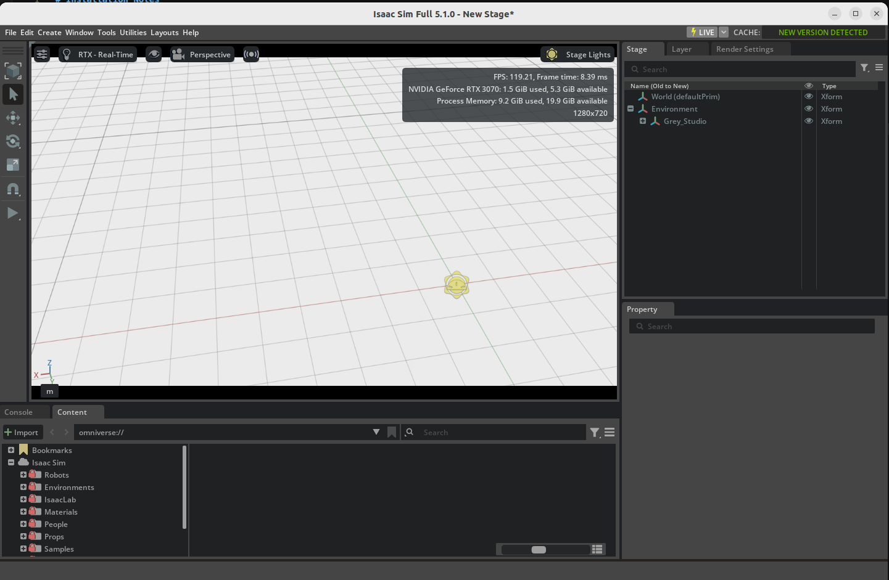
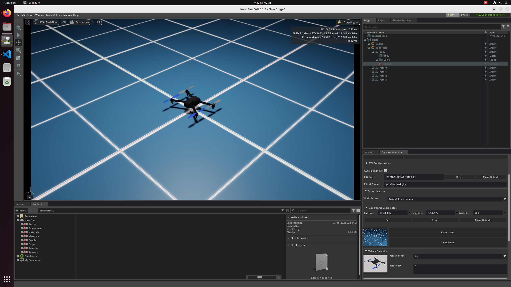
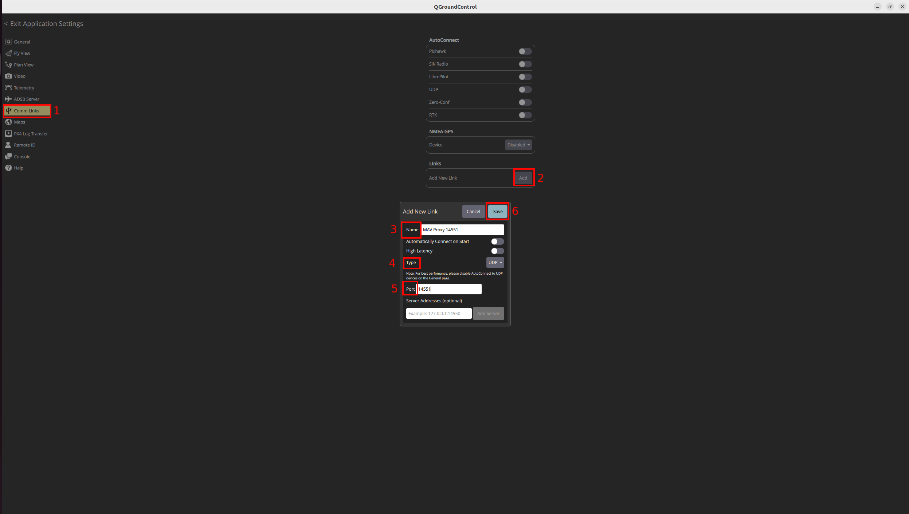

# UAV Simulation Take-Home

This repository documents a reproducible UAV simulation workflow using NVIDIA
Isaac Sim, Pegasus Simulator, PX4 SITL, MAVProxy, and QGroundControl.

The required challenge scope is implemented first: installation notes, PX4 and
Pegasus integration, explicit MAVProxy routing, QGroundControl telemetry through
MAVProxy, and basic verification scripts. Optional extensions such as MAVSDK,
urban environments, gimbal, and camera/video streaming are planned for later
work.

## Documentation

Start here:

| Document | Purpose |
| --- | --- |
| [INSTALLATION.md](INSTALLATION.md) | Detailed installation log, host specs, versions, problems encountered, workarounds, validation results, and known limitations. |
| [RUNBOOK.md](RUNBOOK.md) | Repeatable startup order and day-to-day run instructions for Isaac Sim, Pegasus, PX4, MAVProxy, QGroundControl, and verification scripts. |

## Current Status

Required challenge items:

| Requirement | Status | Evidence |
| --- | --- | --- |
| Installation notes | Complete | [INSTALLATION.md](INSTALLATION.md) |
| Basic PX4 + Pegasus simulation | Complete | PX4/Pegasus heartbeat and telemetry documented in [INSTALLATION.md](INSTALLATION.md) |
| MAVProxy routing | Complete | [configs/run_mavproxy.sh](configs/run_mavproxy.sh) |
| QGroundControl through explicit MAVProxy endpoint | Complete | [evidence/qgroundcontrol-mavproxy-telemetry.png](evidence/qgroundcontrol-mavproxy-telemetry.png) |
| Basic automation / verification | Complete | [scripts/verify_mavlink_route.sh](scripts/verify_mavlink_route.sh), [scripts/verify_mavlink_live.py](scripts/verify_mavlink_live.py), [scripts/report_preflight_status.py](scripts/report_preflight_status.py) |
| Run instructions | Complete | [RUNBOOK.md](RUNBOOK.md) |

## MAVLink Routing

The required route is:

```text
PX4/Pegasus -> MAVProxy -> QGroundControl
                      \-> spare MAVSDK/script port
```

Configured endpoints:

| Purpose | Endpoint |
| --- | --- |
| MAVProxy master input from PX4/Pegasus | `udp:127.0.0.1:14550` |
| QGroundControl explicit output | `udpout:127.0.0.1:14551` |
| Spare MAVSDK/script output through MAVProxy | `udpout:127.0.0.1:14542` |
| PX4 direct onboard endpoint, documented but not used by MAVProxy scripts | `127.0.0.1:14540` |

The executable route configuration is in
[configs/run_mavproxy.sh](configs/run_mavproxy.sh).

## Quick Start

For full startup details, follow [RUNBOOK.md](RUNBOOK.md).

Short version:

1. Complete the one-time shell setup in [RUNBOOK.md](RUNBOOK.md).
2. Launch Isaac Sim with the Pegasus extension.
3. Load the Pegasus scene and Iris vehicle.
4. Press Isaac Sim `Play`.
5. Start MAVProxy with [configs/run_mavproxy.sh](configs/run_mavproxy.sh).
6. Connect QGroundControl to the explicit UDP link at `127.0.0.1:14551`.
7. Run the verification scripts from `scripts/`.

## Verification Scripts

| Script | Purpose |
| --- | --- |
| [scripts/verify_mavlink_route.sh](scripts/verify_mavlink_route.sh) | Non-invasive baseline check for install paths, PX4 version, and MAVProxy endpoint configuration. |
| [scripts/verify_mavlink_live.py](scripts/verify_mavlink_live.py) | Live MAVLink heartbeat and telemetry check through the QGroundControl route. |
| [scripts/report_preflight_status.py](scripts/report_preflight_status.py) | Read-only preflight/status snapshot through the spare MAVSDK/script route. |
| [scripts/mavsdk_status_client.py](scripts/mavsdk_status_client.py) | Read-only MAVSDK client that connects to the spare port and prints connection state, position, attitude, flight mode, battery, and armed state. |

None of the verification scripts arm, take off, change modes, or move the
vehicle. MAVSDK may perform internal telemetry stream setup over MAVLink, but
the client does not send vehicle control actions.

## Evidence

Curated screenshots are stored in [evidence/](evidence/):

| File | Description |
| --- | --- |
| [evidence/isaac-sim-first-launch.png](evidence/isaac-sim-first-launch.png) | Isaac Sim 5.1.0 first successful launch. |
| [evidence/pegasus-extension-launch.png](evidence/pegasus-extension-launch.png) | Pegasus extension enabled with Iris visible in Isaac Sim. |
| [evidence/qgc-comm-links.png](evidence/qgc-comm-links.png) | QGroundControl Comm Links screen with AutoConnect disabled and manual MAVProxy link listed. |
| [evidence/qgc-manual-link-settings-14551.png](evidence/qgc-manual-link-settings-14551.png) | QGroundControl manual UDP link configured for the explicit MAVProxy port `14551`. |
| [evidence/qgroundcontrol-mavproxy-telemetry.png](evidence/qgroundcontrol-mavproxy-telemetry.png) | QGroundControl telemetry through the explicit MAVProxy endpoint. |

### Screenshot Previews

Isaac Sim first launch:



Pegasus extension and Iris vehicle:



QGroundControl Comm Links:


QGroundControl manual MAVProxy link settings:



QGroundControl telemetry through MAVProxy:


A screencast is not required for the current required scope because the
repository already includes screenshots plus command/script validation outputs.
If optional gimbal, camera, or video streaming tasks are implemented later, a
short screencast would be useful evidence.

## PX4 Parameters

No custom PX4 parameters were changed for the required setup. The workflow uses
the default PX4/Pegasus Iris configuration.

## Known Limitations

- Isaac Sim compatibility check reports the RTX 3070 VRAM as below the 10 GB
  requirement, although the required workflow was validated.
- The persistent Pegasus extension path could not be added through the Isaac Sim
  Extensions UI, so the extension is passed at launch time with `--ext-folder`.
- QGroundControl AutoConnect should be disabled and QGroundControl restarted
  before validating the explicit MAVProxy route.
- Remaining optional tasks are listed below.

## Optional Work

Optional challenge items:

| Optional item | Status |
| --- | --- |
| Outdoor / urban Isaac Sim environment | Pending |
| Gimbal and camera | Complete |
| Camera video in QGroundControl | Pending |
| Gimbal control from QGroundControl | Pending |
| True MAVSDK client on the spare port | Complete |

The spare MAVSDK/script route at `127.0.0.1:14542` is configured and validated
with both a read-only `pymavlink` status script and a read-only MAVSDK client.

The optional gimbal/camera workflow is implemented with
[scripts/add_gimbal_camera.py](scripts/add_gimbal_camera.py). It attaches a
simple gimbal transform hierarchy and camera prim under the Pegasus Iris vehicle
body, then switches the Isaac Sim viewport to that camera.
